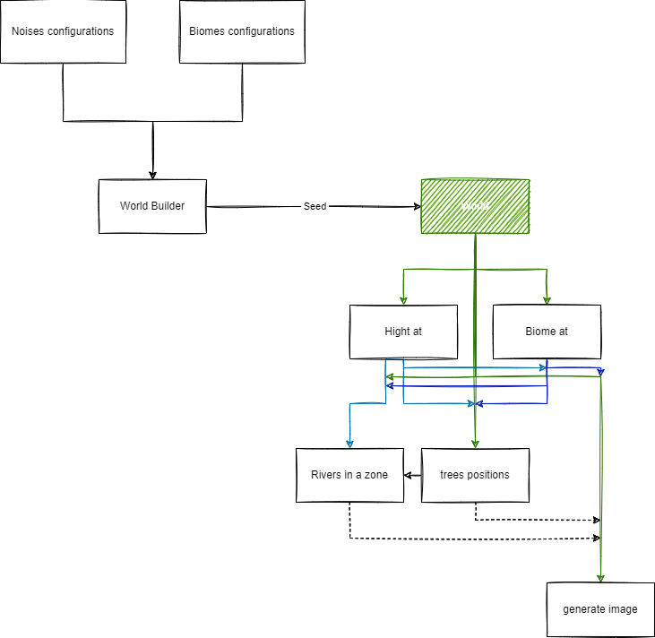

A Java library for procedural generation of 2D maps (or 2D with 3D effects). We have no version yet, but you can contribute to the project by :
- making a pull request
- reporting bugs
- suggesting new features
- asking questions
- giving feedback
- giving us a star
- contribute to the wiki
- **Or simply chat with us on the discussion tab**

See library.png for a preview of the library.

